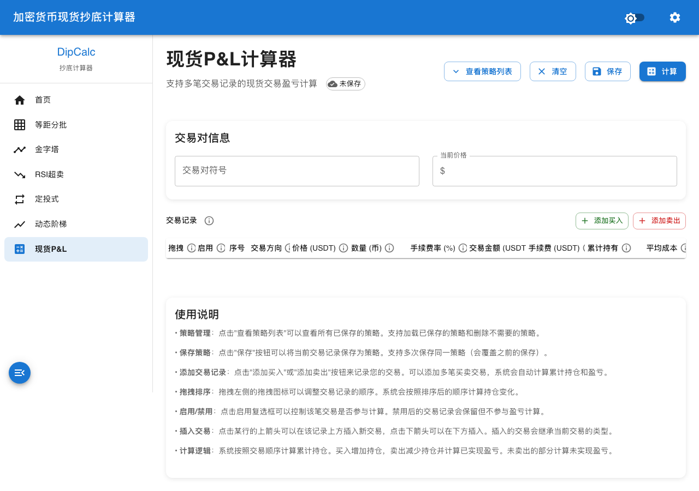
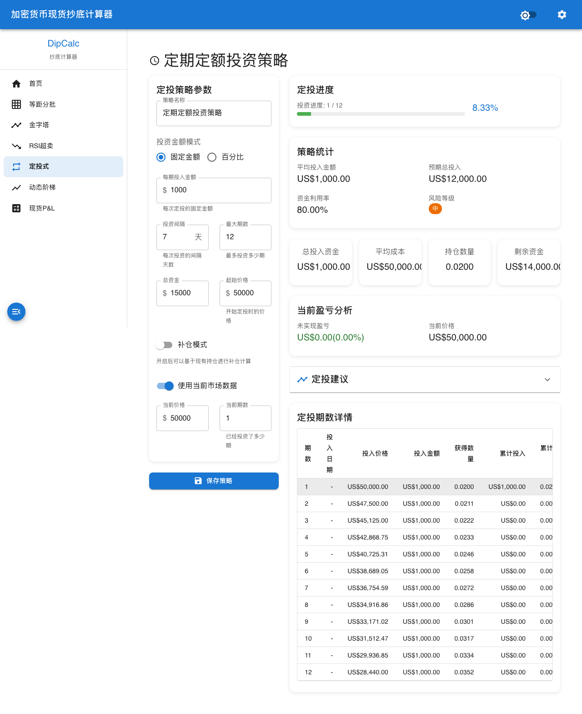

# 加密货币现货抄底计算器

[](https://github.com/tradermoney/grid-dip)
[](https://www.typescriptlang.org/)
[](https://reactjs.org/)
[](https://mui.com/)

一个功能强大的基于 React + TypeScript + Material-UI 的纯前端加密货币现货抄底计算器，提供多种量化投资策略，帮助用户科学制定抄底计划。

## 📸 项目预览

### 首页仪表盘


### 现货PnL计算器


### 等距分批抄底计算器


### DCA定投计算器


### 金字塔策略计算器


### RSI策略计算器


## ✨ 功能特性

### 🎯 多种抄底策略
1. **等距分批抄底 (Grid-Dip)**
   - 固定间隔网格策略，价格每跌固定幅度买入固定金额
   - 适合震荡行情，降低平均成本

2. **金字塔加仓 (Pyramid)**
   - 几何倍数加仓策略，跌得越深加仓越重
   - 快速摊低成本，适合长线布局

3. **RSI超卖策略**
   - 技术指标驱动，只有RSI<30时开始抄底
   - 结合技术分析，过滤假跌破

4. **定投式抄底 (DCA)**
   - 时间+价格双条件触发策略
   - 定期定额投资纪律，降低情绪干扰

5. **ATR动态网格**
   - 基于真实波动率自适应调整
   - 适应市场波动特性

### 🚀 核心功能
- 📊 **实时计算** - 参数更改即时计算结果
- 💾 **数据持久化** - IndexedDB本地存储，支持草稿和策略保存
- 📱 **响应式设计** - 完美适配桌面端和移动端
- 🎨 **Material-UI** - 现代化、专业的用户界面
- ⚡ **风险管控** - 实时风险评估和预警系统
- 📈 **数据可视化** - 丰富的图表展示
- 🔍 **Playwright测试** - 完整的端到端测试覆盖

## 🛠️ 技术栈

- **前端框架**: React 18 + TypeScript
- **UI组件库**: Material-UI (MUI) v5
- **路由管理**: React Router v6
- **图表库**: Recharts + MUI X-Charts
- **拖拽功能**: @dnd-kit
- **数据存储**: IndexedDB
- **构建工具**: Create React App
- **测试框架**: Playwright + Testing Library
- **部署平台**: GitHub Pages

## 🚀 快速开始

### 环境要求
- Node.js >= 16.0.0
- npm >= 8.0.0

### 安装依赖
```bash
npm install
```

### 启动开发服务器
```bash
npm start
```
应用将在 http://localhost:41303 启动

### 构建生产版本
```bash
npm run build
```

### 运行测试
```bash
npm test
```

### 运行端到端测试
```bash
npx playwright install
npx playwright test
```

## 📁 项目结构

```
src/
├── components/           # 通用组件
│   ├── Layout/          # 布局组件
│   ├── Navigation/      # 导航组件
│   └── shared/          # 共享组件
├── pages/               # 页面组件
│   ├── PnL/             # 现货PnL计算
│   ├── GridDip/         # 等距分批抄底
│   ├── Pyramid/         # 金字塔策略
│   ├── RSI/             # RSI策略
│   ├── DCA/             # 定投策略
│   ├── ATR/             # ATR策略
│   └── Home.tsx         # 首页
├── services/            # 业务逻辑
│   ├── database/        # IndexedDB封装
│   │   ├── DataAccessLayer.ts
│   │   └── ...
│   ├── calculators/     # 计算器核心逻辑
│   │   ├── pnlCalculator.ts
│   │   ├── GridDipCalculator.ts
│   │   ├── PyramidCalculator.ts
│   │   ├── DCACalculator.ts
│   │   ├── RSICalculator.ts
│   │   └── ATRCalculator.ts
│   └── risk/            # 风险管理
├── hooks/               # 自定义Hooks
├── types/               # TypeScript类型定义
└── utils/               # 工具函数
```

## 💡 使用指南

### 等距分批抄底策略示例
1. 设置价格区间：$40,000 - $50,000
2. 设置网格数量：10档
3. 设置总资金：$10,000
4. 系统自动计算每档投入和预期平均成本
5. 保存策略后可随时查看进度

### 风险管理
- **最大回撤控制**：设置止损阈值
- **仓位上限**：单次和总仓位控制
- **止盈机制**：设置目标收益率
- **风险评级**：实时风险评估

## 🧪 测试覆盖率

本项目使用 Playwright 进行端到端测试，确保核心功能稳定可靠。

```
✅ 页面加载测试
✅ 导航功能测试
✅ 输入验证测试
✅ 计算逻辑测试
✅ 数据保存测试
✅ 响应式布局测试
```

**当前测试通过率：100%** (11/11 测试用例)

## 📊 计算器说明

### 1. 等距分批抄底 (Grid-Dip)
将预期底部区间等分为N份，价格每跌固定幅度就买入固定金额。

**优势**：
- 适合震荡行情
- 操作简单
- 风险分散

**适用场景**：横盘整理、震荡下跌

### 2. 金字塔加仓 (Pyramid)
使用几何倍数快速摊低成本，抄底成功率更高。

**优势**：
- 快速降低平均成本
- 适合长线布局
- 反弹收益丰厚

**适用场景**：持续下跌、价值投资

### 3. RSI超卖策略
技术指标驱动，RSI<30时才启动抄底。

**优势**：
- 避免抄底过早
- 技术面确认
- 提高胜率

**适用场景**：技术分析参考

## 🔧 配置说明

### 开发环境
```bash
PORT=41303  # 开发服务器端口
```

### 构建优化
- 代码分割
- Tree Shaking
- Gzip压缩
- 资源优化

## 🤝 贡献指南

欢迎提交 Issue 和 Pull Request！

### 开发流程
1. Fork 项目
2. 创建特性分支 (`git checkout -b feature/AmazingFeature`)
3. 提交更改 (`git commit -m 'Add some AmazingFeature'`)
4. 推送到分支 (`git push origin feature/AmazingFeature`)
5. 打开 Pull Request

### 代码规范
- 使用 TypeScript 严格模式
- 遵循 ESLint 配置
- 组件使用函数式写法
- 优先使用 Hooks

## 📝 更新日志

### v1.0.0 (2024-11-02)
- ✅ 初始版本发布
- ✅ 5种抄底策略实现
- ✅ Playwright测试覆盖
- ✅ 响应式设计完成
- ✅ 模块化代码重构

## 📄 许可证

MIT License - 详见 [LICENSE](LICENSE) 文件

## 👨‍💻 作者

**TraderMoney** - *Initial work* - [GitHub](https://github.com/tradermoney)

## 🙏 致谢

- [React](https://reactjs.org/)
- [Material-UI](https://mui.com/)
- [Recharts](https://recharts.org/)
- [Playwright](https://playwright.dev/)

## 📞 联系方式

- 项目链接: [https://tradermoney.github.io/grid-dip](https://tradermoney.github.io/grid-dip)
- 问题反馈: [GitHub Issues](https://github.com/tradermoney/grid-dip/issues)

---

⭐ 如果这个项目对您有帮助，请给它一个星标！
